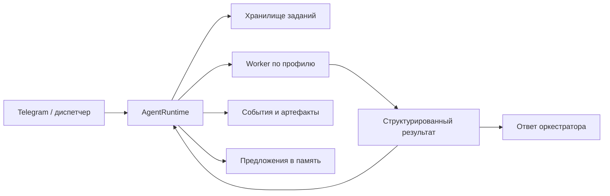

# ZHVUSHA — AI-агент для Telegram

[](https://github.com/KoTTiH/zhvusha-showcase/actions/workflows/quality.yml)


**Pet-проект:** исследование устройства персонального AI-агента с памятью,
фоновыми заданиями и ограничениями на действия инструментов. Этот репозиторий —
публичный срез кода для портфолио и технического ревью.

Задача проекта — связать диалог в Telegram с долгими операциями: сохранить
задание, выбрать исполнителя, проверить разрешения, получить структурированный
результат и передать предложения в память. Здесь можно изучить эти механизмы
и запустить проверки без доступа к личному боту автора.

## Что посмотреть в коде

| Инженерная задача | Реализация | Проверка |
| --- | --- | --- |
| Сохранение заданий и событий | [JSON-хранилище](src/agent_runtime/storage.py), [события](src/agent_runtime/events.py) | [Запись и чтение с диска](tests/agent_runtime/test_storage.py) |
| Жизненный цикл, отмена и восстановление | [AgentRuntime](src/agent_runtime/runtime.py) | [Сценарии runtime](tests/agent_runtime/test_runtime.py) |
| Разрешения на вызовы инструментов | [ToolGateway](src/agent_runtime/tools.py), [capability graph](src/agent_runtime/capability_graph.py) | [Запреты, approval и ограничения путей](tests/agent_runtime/test_tool_gateway.py) |
| Общий порядок вызова skills | [Invocation service](src/skills/invocation.py) | [Prepare, dry-run, approval, execute](tests/skills/test_invocation.py) |
| Выбор LLM-провайдера и уровня модели | [Реестр](src/llm/providers.py), [маршрутизация](src/llm/router.py) | Тесты в [tests/](tests/) |
| Долговременная память | [Episodic memory](src/memory/episodic.py), [pipelines](src/memory/pipelines/) | Тесты памяти в [tests/](tests/) |

## Устройство runtime

Схема показывает ветку делегированного задания. Обычные сообщения и отдельные
skills могут обрабатываться другими ветками диспетчера.



`ToolGateway` проверяет capabilities и approval для инструментов, вызванных
через него. CLI-исполнители дополнительно опираются на собственный sandbox и
политику запуска subprocess. Подробнее — [обзор архитектуры](docs/architecture.md).

## Стек

| Часть | Технологии |
| --- | --- |
| Telegram и сервис | Python 3.12, asyncio, aiogram, Pydantic v2 |
| LLM | Реестр провайдеров, tiers, API- и CLI-адаптеры |
| Память | SQLAlchemy, PostgreSQL, pgvector, Alembic |
| Фоновые процессы | Redis Streams, daemon-модули |
| Качество | pytest, Ruff, mypy strict, GitHub Actions, Gitleaks |

## Быстрый старт для ревью

Нужны Python 3.12 и uv. Команды запускаются последовательно; первые тесты
используют временные файлы и тестовые адаптеры. Реальные Telegram- и AI-ключи
для них не нужны.

```bash
git clone https://github.com/KoTTiH/zhvusha-showcase.git
cd zhvusha-showcase
uv sync --frozen --extra dev
uv run --no-sync pytest -q --no-cov tests/agent_runtime/test_storage.py
uv run --no-sync pytest -q --no-cov tests/skills/test_invocation.py
```

### Что проверяет CI

CI устанавливает зависимости из `uv.lock`. В
[quality.yml](.github/workflows/quality.yml) выполняются Ruff lint и format,
`mypy src/ --strict`, импорт бота и runtime, тесты `tests/agent_runtime` и
`tests/skills/test_invocation.py`, сценарии уточнений Telegram и обработки памяти,
а также Gitleaks. Это выбранные тесты,
без оценки качества ответов моделей и полного прогона всех интеграций.
Import-linter настроен в репозитории, но текущий workflow его не запускает.

### Подключение интеграций

Для исследования остальных модулей есть [.env.example](.env.example),
[Docker Compose](docker-compose.yml) с PostgreSQL/pgvector и Redis,
[миграции](alembic/) и необязательные зависимости `full`. Нужны собственные
настройки сервисов. В шаблоне LLM tiers используют `codex_cli`: для него
требуются отдельно установленный CLI и его авторизация.

Настройка полноценного бота зависит от выбранных провайдеров и функций.
Live-запуск, доставка сообщений, внешние действия и память на реальной базе
не подтверждаются публичным CI.

## Статус и ограничения

- Это экспериментальный pet-проект, без заявления о production-ready агенте.
- При восстановлении прерванное `RUNNING`-задание переводится в `NEEDS_REVIEW`.
  Автоматическое продолжение любой операции не гарантируется.
- Файловое хранилище использует атомарную замену JSON. Распределённые транзакции
  и exactly-once исполнение не реализованы этим механизмом.
- Примеры вымышленные. Личные сценарии автоматизации, переписки, аккаунты,
  рабочая память и приватная история разработки не входят в этот срез.
  Подробнее — [состав публикации](docs/public-scope.md).
- Метрик точности AI, нагрузки и коммерческой эксплуатации здесь нет.

Отдельный продуктовый pet-проект автора —
[AI-дневник питания в Telegram](https://github.com/KoTTiH/zhvusha-miniapp).

## Лицензия

Код доступен для ознакомления и оценки в портфолио на условиях
[Source-Available Portfolio License](LICENSE).

## English summary

A personal pet project exploring a Telegram AI agent with persistent jobs,
capability checks, skill lifecycles and memory staging. This public code snapshot
includes source, tests, migrations and configuration examples for technical
review. CI covers selected contracts and static checks; it does not certify a
production deployment or live model quality.
